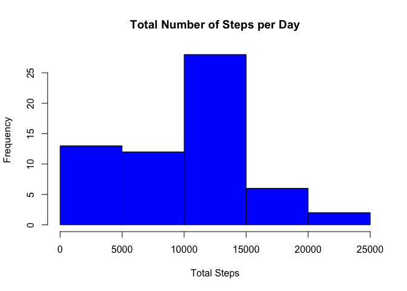
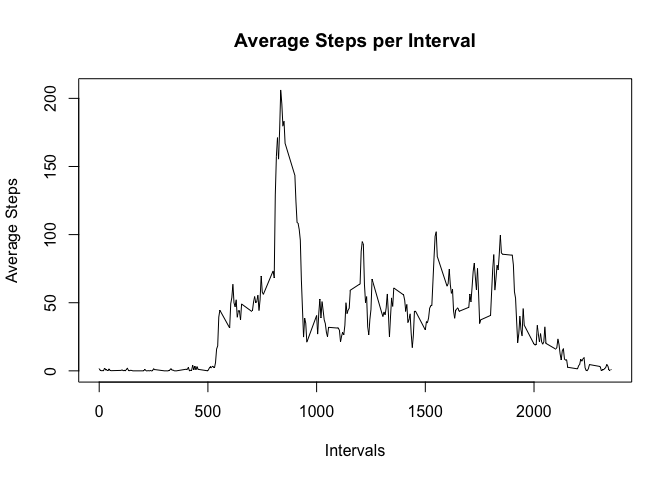
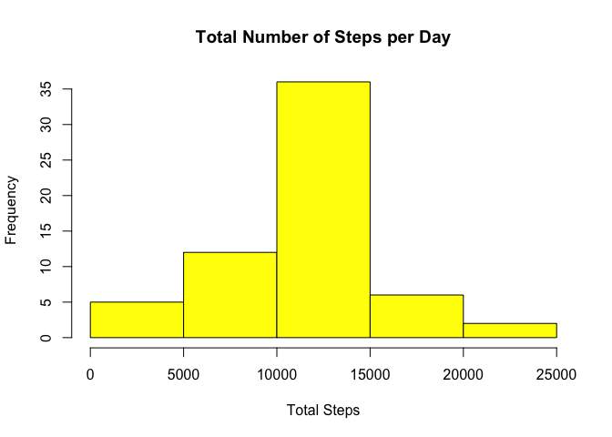
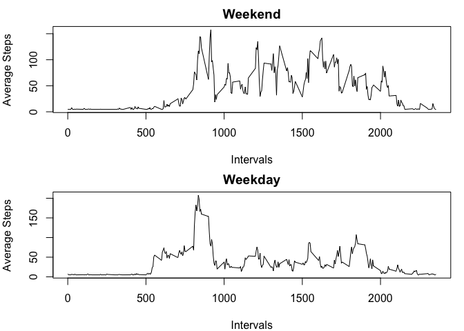

## Loading and preprocessing the data
Set local working directory. Unzip file and load into R. Have a look into the data. Transform the date format and produce some basic summary statistics.


```r
unzip("./activity.zip")
activity <- read.csv("./activity.csv", header = TRUE)
head(activity)
```

```
##   steps       date interval
## 1    NA 2012-10-01        0
## 2    NA 2012-10-01        5
## 3    NA 2012-10-01       10
## 4    NA 2012-10-01       15
## 5    NA 2012-10-01       20
## 6    NA 2012-10-01       25
```

```r
activity[,2] <- as.Date(activity$date)
summary(activity)
```

```
##      steps             date               interval     
##  Min.   :  0.00   Min.   :2012-10-01   Min.   :   0.0  
##  1st Qu.:  0.00   1st Qu.:2012-10-16   1st Qu.: 588.8  
##  Median :  0.00   Median :2012-10-31   Median :1177.5  
##  Mean   : 37.38   Mean   :2012-10-31   Mean   :1177.5  
##  3rd Qu.: 12.00   3rd Qu.:2012-11-15   3rd Qu.:1766.2  
##  Max.   :806.00   Max.   :2012-11-30   Max.   :2355.0  
##  NA's   :2304
```

## Q1: What is mean total number of steps taken per day
Produce histogram to show the distribution of total number of steps.


```r
steps_1<-with(activity,tapply(steps,date,sum,na.rm=TRUE))
hist(steps_1,col = "blue",xlab = "Total Steps",ylab = "Frequency",main = "Total Number of Steps per Day")
```

<!-- -->

Calculate the mean of total number of steps taken per day.

```r
print(mean_steps<-mean(steps_1))
```

```
## [1] 9354.23
```

**The mean is 9354.23.**        
Calculate the median of total number of steps taken per day.


```r
print(median_steps<-median(steps_1))
```

```
## [1] 10395
```
**The median is 10395.**     
Save the plot to repository.


```r
png("q1.png")
hist(steps_1,col = "green",xlab = "Total Steps",ylab = "Frequency",main = "Total Number of Steps per Day")
dev.off()
```

```
## quartz_off_screen 
##                 2
```

## Q2: What is the average daily activity pattern?
make a time series plot of the 5-minute interval (x-axis) and the average number of steps taken, averaged across all days (y-axis).


```r
avg_steps<-with(activity,tapply(steps,interval,mean,na.rm=TRUE))
intervals<-unique(activity$interval)
new<-data.frame(cbind(avg_steps,intervals))
plot(new$intervals,new$avg_steps,type = "l",xlab = "Intervals",
     ylab = "Average Steps",main = "Average Steps per Interval")
```

<!-- -->

Produce 5-minute interval contains the maximum number of steps.


```r
index<-which.max(new$avg_steps)
max<-new[index,2]
print(max)
```

```
## [1] 835
```
**The 5-minute interval that contains the maximum number of steps is 835.**   
Save the plot to repository.

```r
png("q2.png")
plot(new$intervals,new$avg_steps,type = "l",xlab = "Intervals",
     ylab = "Average Steps",main = "Average Steps per Interval")
dev.off()
```

```
## quartz_off_screen 
##                 2
```

## Q3: Imputing missing values

Calculate and report the total number of missing values in the dataset.

```r
sum(is.na(activity$steps))
```

```
## [1] 2304
```

There are 2304 missing values. Create a new dataset that is equal to the original dataset but with the missing data filled in.

```r
index<-which(is.na(activity$steps))
l<-length(index)
steps_avg<-with(activity,tapply(steps,date,mean,na.rm=TRUE))
na<-mean(steps_avg,na.rm = TRUE)
for (i in 1:l) {
        activity[index[i],1]<-na
}
```

Check again to see if the missing values are filled properly.

```r
sum(is.na(activity$steps))
```

```
## [1] 0
```

```r
str(activity)
```

```
## 'data.frame':	17568 obs. of  3 variables:
##  $ steps   : num  37.4 37.4 37.4 37.4 37.4 ...
##  $ date    : Date, format: "2012-10-01" "2012-10-01" ...
##  $ interval: int  0 5 10 15 20 25 30 35 40 45 ...
```

The previous missing values are successfully filled.  
Produce histogram to have a look at the distribution, mean and median again.

```r
steps_2<-with(activity,tapply(steps,date,sum,na.rm=TRUE))
hist(steps_2,col = "yellow",xlab = "Total Steps",ylab = "Frequency",main = "Total Number of Steps per Day")
```

<!-- -->

```r
print(mean_steps_2<-mean(steps_2))
```

```
## [1] 10766.19
```

```r
print(median_steps_2<-median(steps_2))
```

```
## [1] 10766.19
```

The average total steps taken each day is 10766.19 and the median of total steps taken each day is 10766.19. Both the average and the median of the total steps taken eah day after NAs are filled came out to be equal.  
Save plot to repository.


```r
png("q3.png")
hist(steps_2,col = "yellow",xlab = "Total Steps",ylab = "Frequency",main = "Total Number of Steps per Day")
dev.off()
```

```
## quartz_off_screen 
##                 2
```

## Q4: Are there differences in activity patterns between weekdays and weekends?
Create a new variable in the dataset named “day” that shows the day of the week in terms of weekday or weekend.


```r
require(dplyr)
```

```
## Loading required package: dplyr
```

```
## 
## Attaching package: 'dplyr'
```

```
## The following objects are masked from 'package:stats':
## 
##     filter, lag
```

```
## The following objects are masked from 'package:base':
## 
##     intersect, setdiff, setequal, union
```

```r
activity_mod<- mutate(activity, day = ifelse(weekdays(activity$date) == "Saturday" | weekdays(activity$date) == "Sunday", "weekend", "weekday"))
activity_mod$day<-as.factor(activity_mod$day)
str(activity_mod)
```

```
## 'data.frame':	17568 obs. of  4 variables:
##  $ steps   : num  37.4 37.4 37.4 37.4 37.4 ...
##  $ date    : Date, format: "2012-10-01" "2012-10-01" ...
##  $ interval: int  0 5 10 15 20 25 30 35 40 45 ...
##  $ day     : Factor w/ 2 levels "weekday","weekend": 1 1 1 1 1 1 1 1 1 1 ...
```

Plot the weekday and weekend data in seperate graphs.


```r
act_wknd<-subset(activity_mod,as.character(activity_mod$day)=="weekend")
act_wkdy<-subset(activity_mod,as.character(activity_mod$day)=="weekday")
steps_wknd<-with(act_wknd,tapply(steps,interval,mean,na.rm=TRUE))
steps_wkdy<-with(act_wkdy,tapply(steps,interval,mean,na.rm=TRUE))
int_wknd<-unique(act_wknd$interval)
int_wkdy<-unique(act_wkdy$interval)
new_wknd<-data.frame(cbind(steps_wknd,int_wknd))
new_wkdy<-data.frame(cbind(steps_wkdy,int_wkdy))
par(mfrow=c(2,1),mar=c(4,4,2,1))
plot(new_wknd$int_wknd,new_wknd$steps_wknd,type = "l",xlab = "Intervals",
     ylab = "Average Steps",main = "Weekend")
plot(new_wkdy$int_wkdy,new_wkdy$steps_wkdy,type = "l",xlab = "Intervals",
     ylab = "Average Steps",main = "Weekday")
```

<!-- -->

The average steps over the weekends show higher pattern than that of the weekdays.  
Save plot to reposity.


```r
png("q4.png")
act_wknd<-subset(activity_mod,as.character(activity_mod$day)=="weekend")
act_wkdy<-subset(activity_mod,as.character(activity_mod$day)=="weekday")
steps_wknd<-with(act_wknd,tapply(steps,interval,mean,na.rm=TRUE))
steps_wkdy<-with(act_wkdy,tapply(steps,interval,mean,na.rm=TRUE))
int_wknd<-unique(act_wknd$interval)
int_wkdy<-unique(act_wkdy$interval)
new_wknd<-data.frame(cbind(steps_wknd,int_wknd))
new_wkdy<-data.frame(cbind(steps_wkdy,int_wkdy))
par(mfrow=c(2,1),mar=c(4,4,2,1))
plot(new_wknd$int_wknd,new_wknd$steps_wknd,type = "l",xlab = "Intervals",
     ylab = "Average Steps",main = "Weekend")
plot(new_wkdy$int_wkdy,new_wkdy$steps_wkdy,type = "l",xlab = "Intervals",
     ylab = "Average Steps",main = "Weekday")
dev.off()
```

```
## quartz_off_screen 
##                 2
```
